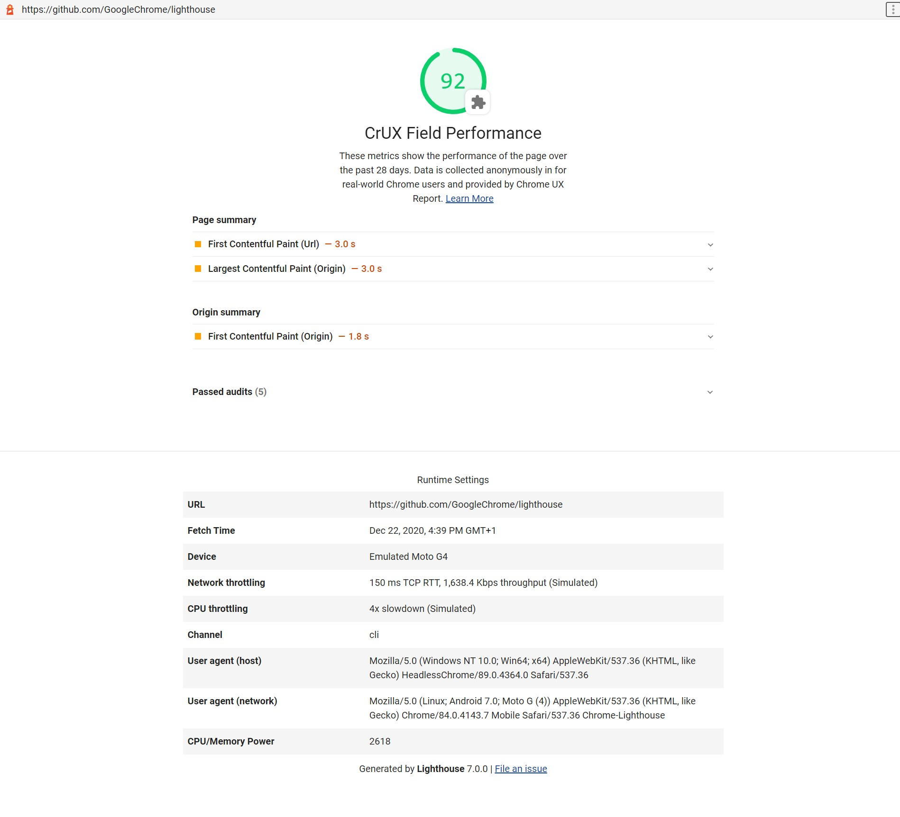

# lighthouse-plugin-crux

> A Lighthouse plugin that displays the field performance of your page.
> It uses real-world data from Chrome UX Report and Core Web Vitals to estimate the score.

[An example report for github.com/GoogleChrome/lighthouse](https://googlechrome.github.io/lighthouse/viewer/?gist=cb20232dcc7a8b4e93d63ae3b09ac47e):



This plugin adds Core Web Vitals values to your Lighthouse report. The CrUX Performance category includes real-user data
provided by [Chrome UX Report](https://developers.google.com/web/tools/chrome-user-experience-report/). It's similar to 
the field section in [PageSpeed Insights](https://developers.google.com/speed/pagespeed/insights/) but it uses the Chrome
User Experience Report API instead of the PageSpeed Insights API. This API is faster than the PSI API since it doesn't 
need run a full lighthouse run to give the results.

The scoring algorithm weighs values for Largest Contentful Paint (LCP), First Input Delay (FID), and Cumulative Layout 
Shift (CLS) and picks a **minimum score**. It uses Core Web Vitals assessment that expects all its metrics to pass 
thresholds. For example, https://edition.cnn.com/ has LCP 5.9 s (15), FID 20 ms (100), and CLS 0.02 (100). It has 
`poor` mark in the [Search Console](https://support.google.com/webmasters/answer/9205520), and the score is 15. 
(_Note_: FCP and the origin values do not affect the score, [see the source](./src/plugin.ts))

Check out the parity between Field & Lab performance on mobile:


And on desktop:


Sometimes field data is missing because a URL doesn't have enough anonymous traffic. In this case, the lab data is the only available measurement.

## Install

Requires Node.js `20+` and Lighthouse `10+`.

```bash
$ npm install lighthouse lighthouse-plugin-crux
```

## Usage

Use the plugin with [Lighthouse CLI](https://github.com/GoogleChrome/lighthouse):

```bash
$ npx lighthouse https://www.apple.com/ --plugins=lighthouse-plugin-crux
```

If you are using the --only-categories option in the CLI, you need to add the `lighthouse-plugin-crux` category to it:

```bash
$ npx lighthouse https://www.apple.com/ --plugins=lighthouse-plugin-crux --only-categories=performance,lighthouse-plugin-crux
```

Provide your [Chrome User Experience Report token](https://developers.google.com/web/tools/chrome-user-experience-report/api/guides/getting-started) to run more requests (in production) with a custom config:

```bash
$ npx lighthouse https://www.apple.com/ --config-path=./config.js
```

`config.js`

```js
export default {
  extends: 'lighthouse:default',
  plugins: ['lighthouse-plugin-crux'],
  settings: {
    cruxToken: 'YOUR_REAL_TOKEN',
  },
}
```

## Credits

Heavily based on the [lighthouse-plugin-field-data](https://github.com/treosh/lighthouse-plugin-field-performance)

[](https://npmjs.org/package/lighthouse-plugin-crux)
[](./LICENSE)
