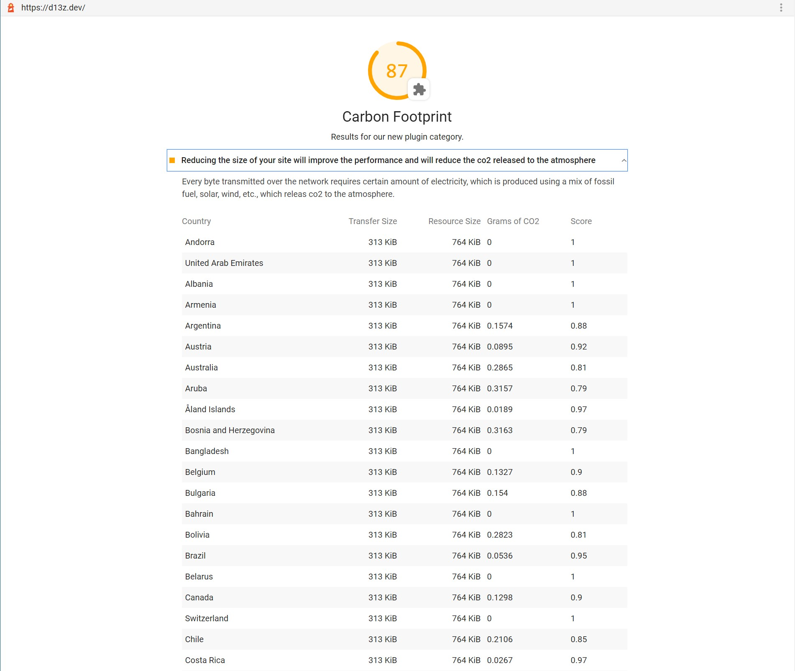

# Lighthouse Plugin CO2
Lighthouse Plugin that estimates the CO2 released to the atmosphere for the analysed page.
Using information of the energy grid of several countries (carbon intensity) and the transferred data over the network.

Overall, the less you transfer, the better the score.

- The calculation is made with the [bytes-to-co2](../bytes-to-co2) library
- The carbon intensity (the amount of co2 produced for kWh) is provided by https://www.electricitymap.org/
- The data to score the results belongs to the https://www.websitecarbon.com/

## To run as a plugin user

1. Install `lighthouse` (v5+) and the plugin `lighthouse-plugin-co2`, likely as `devDependencies`. 
   * `npm install -D lighthouse lighthouse-plugin-co2`
1. To run your private lighthouse binary, you have three options
   1. `npx --no-install lighthouse https://example.com --plugins=lighthouse-plugin-co2 --view`
   1. `yarn lighthouse https://example.com --plugins=lighthouse-plugin-co2 --view`
   1. Add an npm script calling `lighthouse` and run that.

## Result

